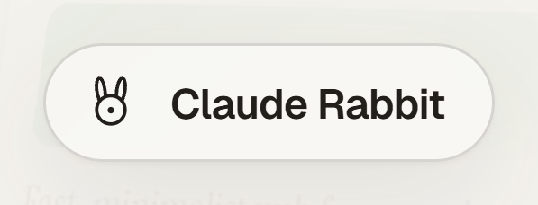
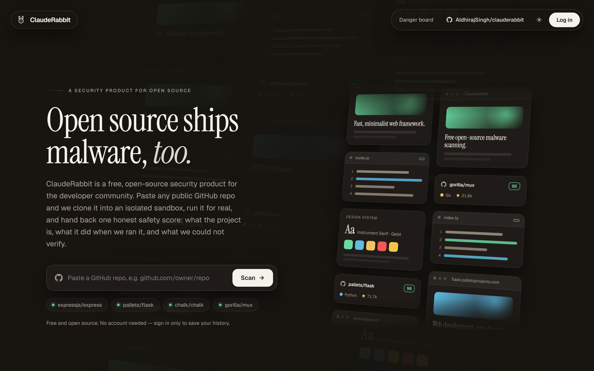
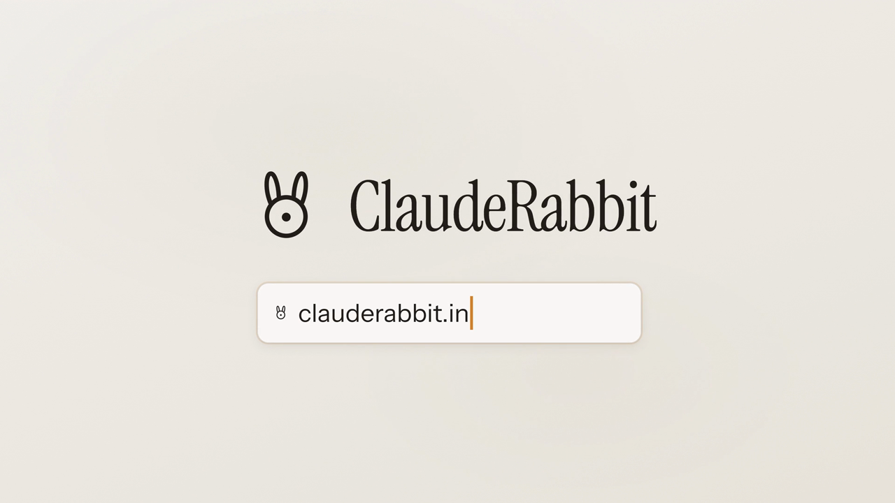

<div align="center">

<picture>
  <source media="(prefers-color-scheme: dark)" srcset="docs/assets/logo-dark-theme.png">
  
</picture>

### Open source ships malware, too.

**Free, open-source malware scanning that doesn't just read a repo — it runs it, in a disposable sandbox, and shows you exactly what it does.**

[](https://www.npmjs.com/package/clauderabbit)
[](LICENSE)
[](https://clauderabbit.in)
[](CONTRIBUTING.md)

[**Scan a repo →**](https://clauderabbit.in) · [CLI](cli/) · [MCP server](mcp-server/) · [How it works](#how-it-works--a-two-speed-funnel) · [Contributing](CONTRIBUTING.md)

</div>

---

## The problem

More than **454,600 new malicious open-source packages** appeared in 2025 — **up 75%** in a single
year — and over 99% of them landed on npm. The attacks that matter carry **no CVE at all**: the
dominant pattern is *install-time execution*, code that runs the moment you `npm install` or clone
and run, harvesting GitHub tokens, cloud credentials, SSH keys, and wallets **before a build even
finishes**. Self-replicating worms (Shai-Hulud and its 2026 descendants) republish themselves
through every developer they touch. A favorite delivery method is a fake recruiter's "take-home"
repo. Every tool that waits for a disclosed vulnerability is, by construction, looking the wrong way.

And the honest developer's side of it: you clone something, run it, and *then* wonder if you should
have. Trust ends up decided on a vibe — stars, a clean README, a gut feeling.

## Nobody built the obvious tool for that

The behavior that defines modern open-source malware is invisible to anything that only *reads*
source and guesses at intent — static scanners, package-reputation tools, the existing free
repo-checkers are all structurally blind to it. So **ClaudeRabbit doesn't guess. It runs the code.**

Paste any public GitHub repo (or an npm package) at **[clauderabbit.in](https://clauderabbit.in)** —
no account needed. Most scans get a clear answer in about ten seconds. If anything still feels
uncertain, it escalates into a **real, disposable sandbox** where the repo actually installs and
runs, live and hermetically isolated. If it tries to phone home or steal a credential, ClaudeRabbit
doesn't just block it — it **forges a fake-success response**, so the malware thinks it got away with
it, and that is the exact moment it's caught. You get back one honest **0–100 safety score**: what
the project is, what it did when we ran it, and — always — **what we could not verify**. Never a
blind "Safe" with nothing behind it. Every report is public and permanent at `/owner/repo`,
shareable, and embeddable as a trust badge.

<div align="center">
  <a href="https://clauderabbit.in"></a>
</div>

## Demo

The 85-second launch film — the threat, the sandbox, and the moment a repo gets caught phoning home.
Click to play, or watch the product live at **[clauderabbit.in](https://clauderabbit.in)**.

<div align="center">
  <a href="docs/assets/demo.mp4"></a>
</div>

> A vertical cut of the same film ships for Reels/Shorts. Direct file: [`docs/assets/demo.mp4`](docs/assets/demo.mp4).

## Quickstart

**On the web** — go to **[clauderabbit.in](https://clauderabbit.in)**, paste a GitHub URL (or
`owner/repo`), hit scan. No login required; signing in only saves your scan history.

**From the terminal** — the [CLI](cli/) ([`clauderabbit`](https://www.npmjs.com/package/clauderabbit)
on npm) scans a repo or npm package before you install or clone it:

```bash
npm install -g clauderabbit                          # one-time setup
clauderabbit scan expressjs/express                  # run a real scan
```

**From an AI coding agent** — the [MCP server](mcp-server/) exposes one cache-aware `scan` tool over
stdio so an agent can check a dependency before it ever clones it (also served remotely over
Streamable HTTP at `clauderabbit.in/mcp` for claude.ai custom connectors). Wire it into Claude
Desktop with `cd cli && npm install && npm run build && node dist/index.js mcp install`.

Both the CLI and the MCP server call the same public scan API the website uses and require a
signed-in ClaudeRabbit account (a real product/access decision, not because the data is sensitive —
report pages stay public either way); the first call opens your browser to sign in once, then stays
silent until you log out. See [cli/README.md](cli/README.md) and
[mcp-server/README.md](mcp-server/README.md) for the full command/tool reference.

## How it works — a two-speed funnel

```
paste URL → API/edge fn → cache check (by commit SHA)
   └─ miss → FAST PATH (~95%): static signals + reputation + a fast model reads only
             the flagged regions → score + confidence
                └─ confident clean → ship verdict
                └─ suspicious / low-confidence → ESCALATE
                      → DEEP PATH (~5%): an AGENTIC analyzer on a throwaway GCP VM —
                        Gemini agents (brain OUTSIDE the blast radius) explore the whole
                        repo for what stage-1 missed, then DETONATE chosen files as a
                        non-root user under a monitored sinkhole, recording CODE-VERIFIED
                        facts (hermetic, egress-locked, no real packet leaves, reset every scan)
   → blend → 0–100 score → report generated from design.md → persist + public /owner/repo
```

Two safety rails, always: **(1)** no surface ever states a bare "Safe" — every verdict shows its
evidence and what was *not* verified; **(2)** the sandbox is hermetic (no real credentials, locked
egress, resource caps) and **reimaged/deleted after every scan**. Reputation signals (owner history,
account age, stars, sentiment) and code/behavior signals (what the code does, what running it
revealed) are always kept visibly separate — you can always tell which is which.

## Stack

| Layer | Choice |
|---|---|
| Web | **Next.js 16 (App Router) + React 19 + TypeScript** — homepage SPA, SSR `/owner/repo` SEO pages, API |
| DB / Auth / Edge | **Supabase** (Postgres + RLS, Google + email/OTP auth, Deno edge functions) |
| Models | **All-Gemini via Vertex AI** — fast `gemini-3.1-flash-lite`, deep/agent `gemini-3.5-flash` (swap seam intact for a future Kimi K2.7 deep-path swap) |
| Scoring | **Code-computed** deterministic formula (`_shared/scoring.ts`) — the model feeds weighted signals; code decides the cited 0–100 |
| Sandbox | **Agentic behavioral analyzer** on Google Cloud — knowledge-graph explore + sinkhole detonate, code-verified facts (`sandbox/`) |
| Design | Faithful port of the shipped Claude Design spec (`design.md`) |

## The model swap seam

**Gemini-via-Vertex is the production model layer** (all-Gemini). The fast/deep model IDs are read
from the Supabase secrets `GEMINI_FAST_MODEL` / `GEMINI_DEEP_MODEL` and called through
`supabase/functions/_shared/vertex.ts`; the agentic sandbox tier (`sandbox/agent/vertex_client.py`)
runs `gemini-3.1-flash-lite` (explore) + `gemini-3.5-flash` (advisor/analysis). The seam stays
intact for a future **Kimi K2.7 Code** deep-path swap — change the secret / that one module;
orchestration, the code-computed scoring, and the escalation gate are real and unchanged.

## Local development

```bash
npm install
cp .env.example .env.local   # fill in the Supabase URL + publishable key (public values)
npm run dev                  # http://localhost:2311
```

`npm run lint` · `npm run typecheck` · `npm run build` all run clean. A CI workflow (lint,
typecheck, build, Deno edge-function tests, gitleaks secret-scan) ships in
`.github/workflows/ci.yml.disabled` — included but currently disabled; rename to `ci.yml` to enable.

## Secrets (server-side only — never in the client or the repo)

The client holds **only** public, non-secret values — `NEXT_PUBLIC_SUPABASE_URL`,
`NEXT_PUBLIC_SUPABASE_PUBLISHABLE_KEY`, and `NEXT_PUBLIC_SITE_URL`. Every actual credential lives in
Supabase edge-function secrets: `GOOGLE_SERVICE_ACCOUNT_JSON`,
`GCP_PROJECT_ID`, `GCP_LOCATION`, `GEMINI_FAST_MODEL`, `GEMINI_DEEP_MODEL`, `GITHUB_TOKEN`
(optional). See `docs/INFRASTRUCTURE.md`.

```bash
supabase db push                          # apply migrations + seed
supabase functions deploy scan --no-verify-jwt
supabase secrets set NAME="value"
```

## Deploy to Vercel

1. Import the repo into Vercel (framework auto-detected: Next.js).
2. Set the `NEXT_PUBLIC_*` env vars (from `.env.example`) in the Vercel project.
3. Deploy. The Supabase backend (DB + edge functions) is live and deployed separately via the
   Supabase CLI; Vercel hosts the Next.js web layer.

## Repo layout

```
app/                     Next.js routes (SPA home, /[owner]/[repo] SSR report, /badge, /auth/callback, /api/deep)
components/spa/          the faithful design port (7 screens + shared chrome + state machine)
lib/                     score logic, types, demo seed, supabase clients, scan client, report view
supabase/migrations/     schema + RLS + scan-limit function
supabase/functions/scan/ the fast-path orchestrator (Vertex seam, GitHub fetch, static signals)
sandbox/                 the dynamic sandbox engine (the moat) — production runs as Cloud Run Job
                         executions (sandbox/cloudrun/), superseding the earlier microVM substrate
cli/                     the clauderabbit CLI (scan, mcp install, login/logout)
mcp-server/              MCP server (one cache-aware scan tool over stdio for AI coding tools)
docs/                    north star, system design / PRD, UX, INFRASTRUCTURE
design.md                the shipped Claude Design spec (source of truth for the UI + reports)
```

## Contributing & community

ClaudeRabbit is a public good, and contributions are welcome — see
**[CONTRIBUTING.md](CONTRIBUTING.md)** for how to run it locally and open a PR, and our
**[Code of Conduct](CODE_OF_CONDUCT.md)**. Good starting points are labelled
[`good first issue`](https://github.com/AIdhirajSingh/clauderabbit/issues?q=is%3Aissue+is%3Aopen+label%3A%22good+first+issue%22).
Questions, ideas, and "is this repo safe?" discussions belong in
[GitHub Discussions](https://github.com/AIdhirajSingh/clauderabbit/discussions).

## License

[MIT](LICENSE) © 2026 Adhiraj Singh.

---

<div align="center">

Free and unlimited, no login or ads ever required to scan. The accumulating database of vetted repos
is the real asset — see [`docs/INFRASTRUCTURE.md`](docs/INFRASTRUCTURE.md) for the honest current
state of the (still-open) monetization question.

</div>
